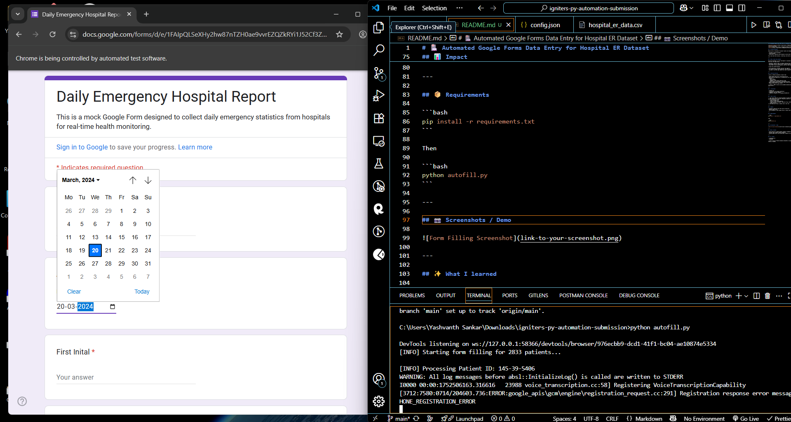

# 🏥 Automated Google Forms Data Entry for Hospital ER Dataset

> My submission for Python Automation Hackathon in Igniters Series organized by Technical Affairs of IIITDM Kancheepuram


## 📌 Problem Statement

Manual entry of thousands of patient records into Google Forms is:

- Extremely **time-consuming**
- **Error-prone**
- Inefficient, especially when hospitals collect data from historical CSV or Excel files

This slows down data analysis, reporting, and overall operational efficiency.

---

## 🎯 Why I chose this problem

During the hackathon, we were challenged to **automate repetitive workflows** or build tools that save real human effort.

- Hospitals, research teams, and admins often get bulk data in CSV/Excel
- But Google Forms (or similar tools) **don’t natively support importing thousands of rows**
- Staff have to enter data manually, which can take hours/days and introduce mistakes

I chose this problem because:

- It’s **practical, relatable, and has real impact**
- It combines **Python, web automation, and data processing**
- Solving it can help teams spend less time on manual work and more time on insights

---

## ⚙️ Solution Overview

I built a **Python automation script** that:

- Reads patient data from a structured CSV file
- Uses **Selenium WebDriver** to automatically fill each field in the Google Form
- Handles:
  - Text fields
  - Numeric fields
  - Dropdowns (like patient admission flag)
  - Radio buttons (like gender & satisfaction score)
- Adds **random delays** to simulate human typing and avoid bot detection
- Submits the form for each record

> ✅ Result: ~2800+ records can be uploaded automatically within minutes, saving massive manual effort

---

## 🛠️ Tech Stack

- **Python 3**
- **Selenium** (for browser automation)
- **pandas** (for CSV reading)
- **Webdriver Manager** (for managing ChromeDriver)

---

## 🚀 How it works

1. Load config JSON file containing XPaths of Google Form fields
2. Read hospital data from CSV (`hospital_er_data.csv`)
3. For each patient record:
   - Open the Google Form
   - Autofill fields using Selenium
   - Select options like gender, admission flag, satisfaction score
   - Submit the form
4. Add random wait times to behave like a real user

---

## 📊 Impact

- Automates repetitive work that used to take hours
- Reduces human errors
- Can be adapted to other Google Forms or similar web tools

---

## 📦 Requirements

```bash
pip install -r requirements.txt
```

Then

```bash
python autofill.py
```

---

## 📷 Screenshots / Demo



---

## ✨ What I learned

- Using Selenium to handle dynamic elements (dropdowns, radio buttons)
- Writing clean, modular Python automation
- Handling edge cases like missing data, element not interactable, etc.

---

## 🧑‍💻 Author

- **Yashvanth S**
- CS24I1029

> _Built as part of Python Automation Hackathon in Igniters Series organized by Technical Affairs of IIITDM Kancheepuram_
